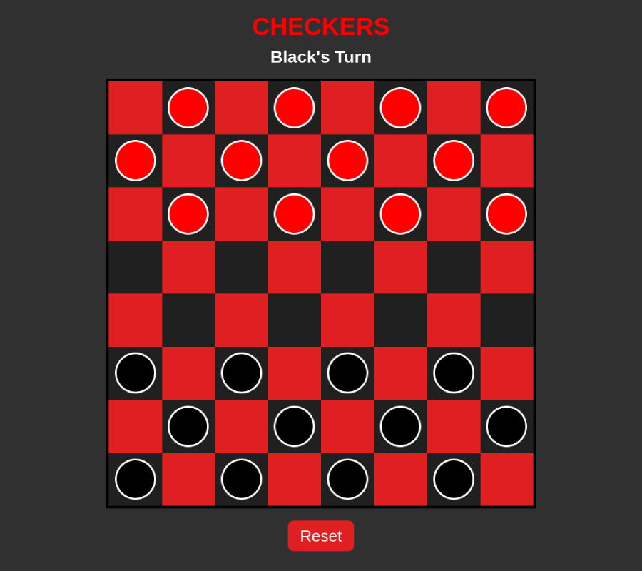

# Checkers
Play classic [**American Checkers**](https://en.wikipedia.org/wiki/English_draughts) on an 8x8 checkerboard with two human players head to head. Remember, if a jump is available, you have to take it!

## Screenshots

## Technologies Used
- HTML
- CSS
- JavaScript

## Getting Started
**[Click here](https://fastlane27.github.io/checkers-game/) to play the game!**  
Remember, if a jump is available you have to take it!

---
## Next Steps
- Highlight squares a piece can move to
- Add counters for pieces captured
- Add sound effects when moving pieces
- Add click and drag functionality
- Add a check for tie games