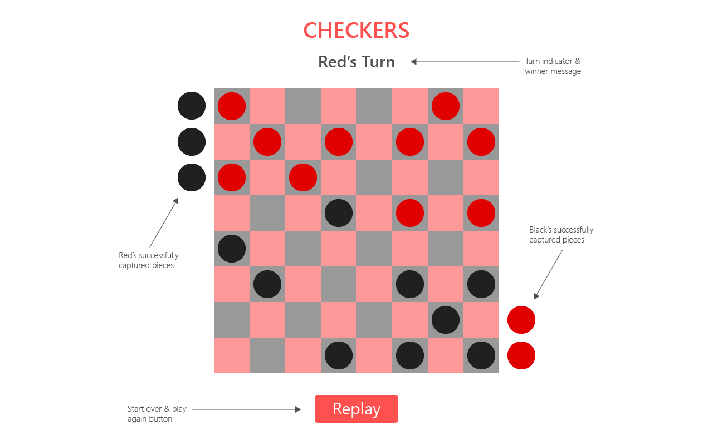

# Checkers

### Description
Play classic **American Checkers** on an 8x8 checkerboard requiring two human players.

### User Stories
- AAU click on a checker to select it for a move.
- AAU click on a valid square to move the selected piece.
- AAU click the replay button to reset the board and start a new game.

### Wireframe


### Pseudocode

```
1. Define required constants
 - Define two-dimensional array to store checkerboard grid positions
 - Define game object housing checker pieces by color for each player

2. Define game state variables
 - Define turn variable to store and track player turns
 - Define winner variable to track and check for win condition

3. Store elements on the page that will be accessed
 - Select and store all grid elements of the checkerboard
 - Store turn/win message element
 
4. Initialize state variables
 - Initialize player turn by setting to 1 or -1 for player 1 and 2 respectively
 - Initialize winner to null to represent no current winner or 1/-1 to indicate winner

5. Render the game based on state
 - Loop over game pieces object to create and render game pieces to the board
 - Use each index of board grid to place pieces in correct position
 - If game piece captured, render to side of board
 - Set turn/win message to display player turn if game not over or win message if winner
 - Add crown symbol to game piece if piece becomes king
 
6. Handle players selecting and moving game pieces
 - Obtain index of grid position clicked on by player, if game piece present and color matches turn, select piece
 - Obtain each index on grid adjacent to selected piece, highlight valid move positions
 - Check if enemy piece in jumpabled position of selected piece and jump position not occuppied
 - If player clicks on valid position, move selected piece to new position
 - If move jumps over enemy piece, remove ('capture') enemy piece from grid and place next to board
 - Remove/disable handler from pieces captured to prevent selecting
 - If piece reaches opposite end of board, king it and enable backward movement
 - After player successfully moves piece, flip turn value (multiply by -1)
 - If a player has no pieces on board, set win value to player number with pieces still on the grid
 
 7. Handle replay button click
 - Set game to initial state if player clicks on replay button
```
